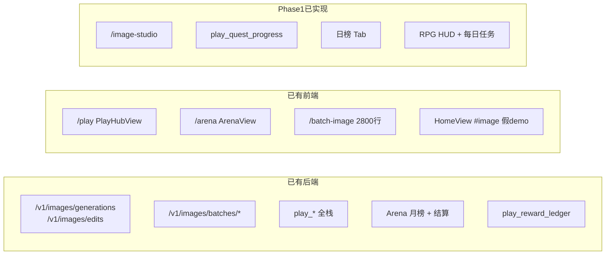
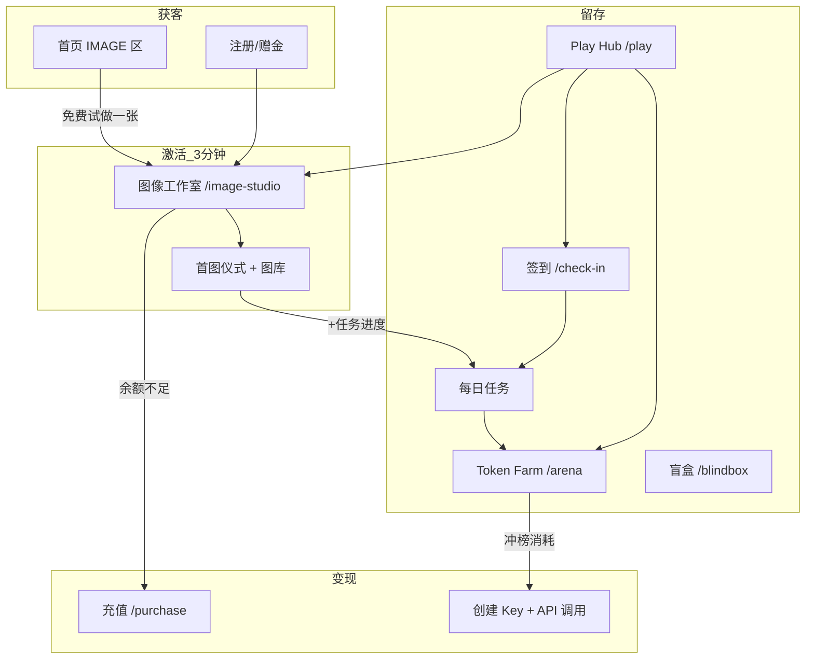
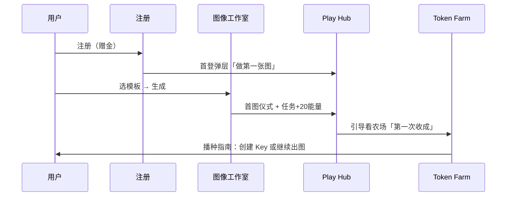

> 状态：historical
> 归档时间：2026-07-15
> 本文只用于追溯 2026-07 的产品决策，不得作为当前实现或验收依据。当前行为见 [Growth / Play](../GROWTH_PLAY.md)、[图像工作室](../IMAGE_STUDIO.md) 与 [增长埋点](../growth-analytics.md)。

---

# 极速蹬增长世界 — 详细产品方案 v1.0

基于 Play 增长栈（Hub / Arena / 图像 API）、Batch Image 独立控制台与首页 IMAGE 营销区的现状，本 PRD 定义 **增长操作系统 + 图像工作室** 双核方案。目标：**增长 → 帮助用户 → 留住用户**。

## 0. 执行摘要

| 维度 | 结论 |
|------|------|
| **战略定位** | 不做「仿 sui-xiang 两页」，做 **「增长操作系统 + 图像工作室」** — API 中转站的壳，新手 3 分钟出片 + 老手冲榜有反馈的增长世界 |
| **核心缺口** | 新手无「单张出图」入口；Play 与图像割裂；首页叙事（「每日奖励」）与月榜 Arena 脱节；无跨功能任务 |
| **Phase 1 交付**（4 周） | `/image-studio` MVP + `/arena` RPG 皮肤 + 日榜 Tab + 每日任务条 + Hub 融合入口 |
| **建议优先级** | **P0：图像工作室**（拉新转化）与 **农场 RPG 换皮+日榜**（留存）并行，但研发资源紧时 **先做工作室** |

---

## 1. 现状与可复用资产（代码锚点）

你们不是从 0 开始，已有大量可复用：



| 资产 | 路径/能力 | 复用方式 |
|------|-----------|----------|
| 单图 API | Gateway `generations` / `edits` | 工作室直连，不走 Gemini batch |
| 计费/余额 | 现有 billing + hold | 生成前估价 + 不足引导 `/purchase?return=/image-studio` |
| Batch 控制台 | `BatchImageGuideView.vue` | **不合并**，工作室走实时单张；batch 保留给 power user |
| Arena 框架 | `play_arena_periods` + `usage_logs` | 月榜沿用；新增日榜 period |
| 奖励账本 | `play_reward_ledger` | 日奖/任务奖走同一 ledger + 幂等 key |
| Campaign | `play_campaigns.rules_json` | 扩展 `image_studio_discount_pct` 等 |
| Hub 聚合 | `GET /play/hub` | 扩展 `quests` + `image_studio` 卡片 |

**Phase 0 文案债** ✅ 已修正：
- 首页 Channel TV / `jisudeng-home.zh.ts` `ch4.hint` 统一为 **「每日任务有奖 · 每月赛季大奖」**

---

## 2. 产品架构：增长世界一张图



**融合原则（宪法）**：
1. Never blank canvas — 意图卡片 + 模板默认填好
2. Show cost before magic — 生成前见价格与余额
3. One win in 3 minutes — 注册后首图必达
4. Progress always visible — 农场/任务永远显示「还差多少」
5. Cross-feature quests — 生图、签到、API 互相导流
6. Privacy as feature — 图库可选 7 天自动清理
7. Ink RPG, not carnival — 黑白 ink HUD，不抄廉价页游

---

## 3. 功能 A：图像工作室（Image Studio）详细 PRD

### 3.1 定位与命名

- **产品名**：图像工作室（对内 `image-studio`）
- **一句话**：不会写 prompt，3 分钟出一张能用的图
- **与 Batch Image 关系**：工作室 = 新手/单张/模板；Batch = 老手/批量/Gemini — **菜单并列，Hub 主推工作室**

### 3.2 信息架构（Phase 1 → Phase 2）

| 层级 | Phase 1 | Phase 2 |
|------|---------|---------|
| L1 意图 | 3 类：电商白底 / 小红书封面 / 自由创作 | 扩至 6–8 类 |
| L2 模板 | 每类 1 个默认模板 | 每类 3–5 + Recipe 保存 |
| L3 表单 | 描述、主色、尺寸 | + 参考图上传（edits） |
| L4 专家 | 折叠 prompt 编辑 | 同 |
| L5 生成 | 1–4 张变体 | 同 + QA 清单 |
| L6 交付 | 下载 + 简单图库 | 多尺寸导出 |

### 3.3 页面线框（Phase 1）

```
┌─────────────────────────────────────────────────────────────┐
│ 图像工作室                              余额 $12.50  [充值]   │
├─────────────────────────────────────────────────────────────┤
│ Step 1/4  你想做什么？                                        │
│ ┌──────────┐ ┌──────────┐ ┌──────────┐                      │
│ │ 电商白底  │ │ 小红书封面│ │ 自由创作  │                      │
│ └──────────┘ └──────────┘ └──────────┘                      │
├─────────────────────────────────────────────────────────────┤
│ Step 2/4  选模板 · 亚马逊主图 1:1                             │
│ [预览缩略图]  纯白底 · 产品居中 · 柔光                          │
├─────────────────────────────────────────────────────────────┤
│ Step 3/4  填写内容                                            │
│ 产品/主题描述 [________________________]                      │
│ 主色调 [■]  尺寸 [1:1 ▼]  生成数量 [4 ▼]                       │
│ ▸ 专家 prompt（折叠）                                          │
├─────────────────────────────────────────────────────────────┤
│ Step 4/4  确认生成                                            │
│ 使用 Key: [我的默认 Key ▼]                                    │
│ 预估费用: ~$0.08 · 余额充足 ✓                                  │
│ [生成 4 张变体]                                                │
├─────────────────────────────────────────────────────────────┤
│ 我的图库（最近 20 张）                          [7天自动清理 ☑] │
│ [thumb][thumb][thumb]...                                      │
└─────────────────────────────────────────────────────────────┘
```

### 3.4 路由与权限

| 路由 | 组件 | 鉴权 | Feature Flag |
|------|------|------|--------------|
| `/image-studio` | `ImageStudioView.vue` | JWT | `image_studio_enabled`（新） |
| `/image-studio/gallery` | 可 Phase 1 内嵌 Tab | JWT | 同上 |

**入口改造**：
- 首页 `#image` CTA：`免费试做一张` → `/image-studio`（未登录 → `/register?return=/image-studio`）
- Play Hub：新增卡片「今日出图」
- 侧边栏：在「增长」组上方或「我的账户」区增加「图像工作室」（与 batch-image 分开）
- Dashboard QuickActions：工作室优先于 batch-image（新手可见）

### 3.5 API 清单（Phase 1）

#### 新增 BFF（JWT，不走用户自填 Gateway Key 的复杂流）

| 方法 | 路径 | 说明 |
|------|------|------|
| GET | `/api/v1/image-studio/templates` | 意图 + 模板列表（可静态 JSON 起步） |
| GET | `/api/v1/image-studio/estimate` | `?template_id=&count=&size=` → 预估费用 |
| POST | `/api/v1/image-studio/generate` | 服务端代调 Gateway，扣余额 |
| GET | `/api/v1/image-studio/jobs` | 用户图库列表（分页） |
| GET | `/api/v1/image-studio/jobs/:id` | 单任务详情 + 图片 URL |
| DELETE | `/api/v1/image-studio/jobs/:id` | 用户删除 |

#### 复用 Gateway（BFF 内部调用）

```
POST /v1/images/generations
POST /v1/images/edits          # Phase 2
```

#### `POST /image-studio/generate` 请求体

```json
{
  "template_id": "ecom-white-bg",
  "user_prompt": "无线蓝牙耳机，磨砂黑",
  "accent_color": "#1a1a1a",
  "size": "1024x1024",
  "count": 4,
  "expert_prompt": null,
  "api_key_id": 123
}
```

#### 响应

```json
{
  "job_id": "uuid",
  "status": "completed",
  "estimated_cost": 0.08,
  "actual_cost": 0.08,
  "images": [
    { "id": "...", "url": "/api/v1/image-studio/assets/...", "width": 1024, "height": 1024 }
  ],
  "quest_progress": { "daily_image": { "completed": true, "reward_energy": 20 } }
}
```

### 3.6 数据模型（新增 migration `178_image_studio.sql`）

```sql
-- 模板可 Phase 1 放代码/JSON，DB 可选
CREATE TABLE image_studio_jobs (
  id            UUID PRIMARY KEY DEFAULT gen_random_uuid(),
  user_id       BIGINT NOT NULL REFERENCES users(id),
  template_id   TEXT NOT NULL,
  prompt_final  TEXT NOT NULL,        -- 可配置「不落盘」：仅存 hash
  size          TEXT NOT NULL,
  count         INT NOT NULL DEFAULT 1,
  status        TEXT NOT NULL,        -- pending|running|completed|failed
  estimated_cost NUMERIC(12,4),
  actual_cost   NUMERIC(12,4),
  api_key_id    BIGINT,
  created_at    TIMESTAMPTZ NOT NULL DEFAULT now(),
  expires_at    TIMESTAMPTZ           -- 用户选 7 天清理
);

CREATE TABLE image_studio_assets (
  id         UUID PRIMARY KEY DEFAULT gen_random_uuid(),
  job_id     UUID NOT NULL REFERENCES image_studio_jobs(id) ON DELETE CASCADE,
  url_path   TEXT NOT NULL,
  sort_order INT NOT NULL DEFAULT 0,
  created_at TIMESTAMPTZ NOT NULL DEFAULT now()
);

CREATE INDEX idx_image_studio_jobs_user_created ON image_studio_jobs(user_id, created_at DESC);
```

**隐私选项**：`play` settings 增加 `image_studio_store_prompts`（默认 false，只存 template_id + hash）

### 3.7 模板 JSON 结构（Phase 1 静态文件）

路径建议：`frontend/src/content/image-studio-templates.json` + 后端同构校验

```json
{
  "intents": [
    {
      "id": "ecommerce",
      "label": { "zh": "电商主图", "en": "E-commerce" },
      "templates": [
        {
          "id": "ecom-white-bg",
          "label": { "zh": "亚马逊白底主图" },
          "defaults": {
            "size": "1024x1024",
            "count": 4
          },
          "prompt_template": "Professional product photo, {{subject}}, pure white background RGB 255, centered, soft studio lighting, 85% frame fill, no text, no watermark",
          "compliance_hints": ["亚马逊主图需纯白底", "主体占画面 85%"],
          "price_multiplier": 1.0
        }
      ]
    }
  ]
}
```

### 3.8 与 Play 联动

| 事件 | 动作 |
|------|------|
| 首次完成生图 | Hub 弹「第一次收成」庆祝（localStorage `studio_first_win`） |
| 每日首次生图 | `play_quest_progress` +1 → 农场 +20 能量（展示用） |
| 余额不足 | CTA → `/purchase?return=/image-studio` |
| VIP | Phase 2：解锁高级模板 |

### 3.9 验收标准（Phase 1）

- [x] 未登录用户从首页 3 分钟内完成注册并生成至少 1 张图
- [x] 生成前展示预估费用，余额不足有明确充值引导
- [x] 图库可查看、下载、删除
- [x] 完成生图后 Hub `pending_actions` 或任务条更新
- [ ] 失败/审核拦截有友好文案，额度退回（若已扣）— 待 moderation 链路完善

---

## 4. 功能 B：Token Farm RPG 详细 PRD

### 4.1 重新定义

不是 SimCity，是 **「API 消耗可视化 RPG」** — 底层 **不推翻** `usage_logs` + `play_arena_periods` + `SettleArenaPeriod`。

### 4.2 Phase 1 改造范围

| 模块 | 现状 | Phase 1 |
|------|------|---------|
| 视觉 | 表格 + 文案 | Ink RPG HUD（等级条、Buff 图标、地图占位） |
| 排行 | 仅月榜 | **日榜 Tab + 月榜 Tab** |
| 任务 | 无 | 每日任务条 3 项 |
| 空状态 | 弱 | 「播种指南」3 步 |
| 奖励 | 月结手动 | 日榜小额自动 ledger（cron） |

### 4.3 页面线框

```
┌─────────────────────────────────────────────────────────────┐
│ TOKEN FARM · 七月赛季              Lv.12 耕作者               │
│ ████████░░░░  距 Lv.13 还差 2,400 能量                        │
│ Buff: [充值×1.5] [活动×1.2]                                  │
├─────────────────────────────────────────────────────────────┤
│ [地图] [每日任务] [日榜] [月榜] [奖励箱]                        │
├─────────────────────────────────────────────────────────────┤
│ 今日任务                                                      │
│ ☑ 签到          +10 能量                                      │
│ ☐ 出图 1 张      +20 能量   → /image-studio                   │
│ ☐ API 调用 1 次  +15 能量   → /keys                           │
├─────────────────────────────────────────────────────────────┤
│ 主田：本月 128,000 tokens（展示 ×1.5）                        │
│ 排名 #8 · 距 #7 差 45,000 · 预估赛季奖 $5–$20                  │
└─────────────────────────────────────────────────────────────┘
```

### 4.4 日榜数据模型（`179_play_daily_arena.sql`）

```sql
-- 日榜复用 arena 框架，period type 区分
ALTER TABLE play_arena_periods ADD COLUMN IF NOT EXISTS period_type TEXT NOT NULL DEFAULT 'monthly';
-- period_type: 'daily' | 'monthly' | 'rookie' (Phase 2)

-- 日榜 settings（play_runtime JSON）
-- play_daily_arena_enabled: true
-- play_daily_arena_top_rewards: [{ "rank_max": 1, "amount": 0.5 }, { "rank_max": 3, "amount": 0.2 }]
```

**日榜逻辑**：
- `EnsureDailyArenaPeriod`：UTC+8 0 点创建当日 period
- 排行仍来自 `usage_logs` 当日 token sum
- `SettleDailyArenaPeriod`：次日 0:05 cron，Top N 写 ledger `arena_daily_settlement:{date}:{userId}`

### 4.5 每日任务系统（`180_play_quests.sql`）

```sql
CREATE TABLE play_quest_progress (
  user_id     BIGINT NOT NULL,
  quest_date  DATE NOT NULL,
  quest_key   TEXT NOT NULL,   -- checkin | image_generate | api_call
  completed   BOOLEAN NOT NULL DEFAULT false,
  completed_at TIMESTAMPTZ,
  reward_claimed BOOLEAN NOT NULL DEFAULT false,
  PRIMARY KEY (user_id, quest_date, quest_key)
);
```

**任务定义（settings JSON `play_daily_quests`）**：

```json
[
  { "key": "checkin", "energy": 10, "auto": true },
  { "key": "image_generate", "energy": 20, "min_count": 1 },
  { "key": "api_call", "energy": 15, "min_tokens": 1 }
]
```

**能量 → 等级（纯展示，Phase 1 不做复杂数值）**：

```text
user_energy = sum(completed_quest.energy) + floor(monthly_tokens / 10000)
level = floor(sqrt(user_energy / 100)) + 1
```

### 4.6 API 扩展

| 方法 | 路径 | 说明 |
|------|------|------|
| GET | `/play/arena/daily/current` | 日榜个人状态 |
| GET | `/play/arena/daily/leaderboard` | 日榜 Top 50 |
| GET | `/play/quests/today` | 今日任务 + 能量/等级 |
| POST | `/play/quests/claim` | 领取任务奖励（幂等） |

**扩展 `GET /play/hub`**：

```json
{
  "quests": {
    "energy": 120,
    "level": 12,
    "energy_to_next_level": 2400,
    "tasks": [
      { "key": "checkin", "completed": true, "energy": 10 },
      { "key": "image_generate", "completed": false, "energy": 20, "cta_route": "/image-studio" }
    ]
  }
}
```

### 4.7 需补的工程债

| 项 | 说明 |
|----|------|
| Admin Arena Settle | `POST /admin/play/arena/settle` 注册到路由 |
| Campaign Admin UI | Phase 2；Phase 1 仍 SQL |
| 埋点 | 见第 6 节 |

### 4.8 验收标准（Phase 1）

- [x] 日榜/月榜 Tab 可切换，数据正确
- [x] 签到/生图/API 任务状态实时更新（`api_call` 阈值 ≥100 tokens）
- [x] 零消耗用户看到播种指南
- [x] Buff（Recharge Boost / Campaign）有图标展示
- [x] 日榜次日自动发小额奖励到余额（cron + 日预算上限 $50）

---

## 5. Play Hub 融合改造

### 5.1 卡片重排（优先级从上到下）

1. **今日任务**（新，置顶横幅）— `pending_actions` 来源扩展
2. **图像工作室**（新）— 「出图赚能量」
3. 签到
4. Token Farm — 显示日榜排名 + 月榜排名摘要
5. 盲盒 / 答题 / Team

### 5.2 `pending_actions` 新规则

```
pending = 未签到 + 可开盲盒 + 未答题 + 未完成任务数 + 首图未完成（新用户）
```

### 5.3 新手一条线（Onboarding）



---

## 6. 度量与埋点（Phase 0 必须启动）

| 事件 | 属性 | 用途 |
|------|------|------|
| `image_studio_intent_select` | intent_id | 漏斗 |
| `image_studio_generate_click` | template_id, estimated_cost | 转化 |
| `image_studio_generate_success` | actual_cost, count | 留存/ARPU |
| `image_studio_insufficient_balance` | balance | 充值转化 |
| `farm_quest_complete` | quest_key | 日活 |
| `farm_daily_tab_view` | — | 日榜参与度 |
| `play_hub_action_click` | card_key | Hub 效能 |

**North Star 指标**：
- **激活率**：注册 → 7 天内至少 1 次生图或 API 调用
- **D7 留存**：Play 用户 vs 非 Play 用户
- **工作室 → 充值转化**：余额不足点击充值 → 完成支付

---

## 7. 实施路线图（修订版）

| 阶段 | 周期 | 交付 | 用户价值 |
|------|------|------|----------|
| **Phase 0** | 3 天 | 对标录屏、sui-xiang 走查、文案修正、埋点方案 | 对齐预期 |
| **Phase 1** | 4 周 | 工作室 MVP + 农场 RPG 皮肤 + 日榜 + 任务 + Hub 融合 | 新手能出图、老手有日反馈 |
| **Phase 2** | 4–6 周 | Recipe、参考图、多尺寸导出、新秀榜、预估奖励、VIP 模板 | 电商场景领先 |
| **Phase 3** | 2–3 月 | 行业包、Team 公会战、增长周报 | 自立壁垒 |

### Phase 1 迭代拆分（4 周）

| 周 | 后端 | 前端 |
|----|------|------|
| W1 | `image_studio_*` 表 + estimate/generate BFF | 路由 + 意图/模板 Step 1–2 |
| W2 | 图库 API + quest 表 + hub 扩展 | 生成流 + 费用预览 + 图库 |
| W3 | 日榜 period + daily leaderboard API | Arena RPG 皮肤 + 日/月 Tab |
| W4 | 日榜结算 cron + quest 完成钩子 | Hub 融合 + 首页 CTA + 首图仪式 + 联调 |

---

## 8. 多角色评审会纪要

模拟 **产品、设计、工程、增长、运营、数据、财务、法务** 八方评审，对 Phase 1 方案提出质疑与优化。

---

### 8.1 产品经理（PM）

**认可**：双核 + Hub 融合方向正确；「3 分钟首图」是清晰激活指标。

**质疑**：
- Phase 1 同时做工作室 + 农场 RPG + 日榜，范围偏大，可能两头浅
- 与 Batch Image 的用户重叠未定义清楚

**优化意见**：
1. **明确 Persona 优先级**：P0 是「注册未调用 API 的新手」→ 工作室必须先于 batch 曝光
2. **MVP 砍 Scope**：Phase 1 农场先做「皮肤 + 任务条」，日榜可 **Top 10 小额** 而非全量结算
3. **成功标准写进 PRD**：注册 → 首图 ≥ 25%；工作室用户 D7 ≥ 非工作室 +10%

---

### 8.2 UX / 视觉设计

**认可**：Ink RPG 与品牌一致；意图向导符合 Canva 教训。

**质疑**：
- 4 步向导对老用户可能冗长
- RPG「地图」若只是占位图，反而显空

**优化意见**：
1. **快捷模式**：老用户 / 二次访问默认 **Step 3 表单 + 上次模板**
2. **地图 Phase 1 不做假 3D**，用 **「主田进度条 + 季节插画」** 静态 SVG 即可
3. **首图仪式**全屏 1.5s 即可，可跳过；庆祝文案强调「已入账图库」而非技术成功
4. **费用预览**用绿色/琥珀色状态 pill，比纯文字更建立信任

---

### 8.3 后端 / 架构

**认可**：BFF 代调 Gateway 可统一计费；Arena 日榜复用 period 表合理。

**质疑**：
- 服务端代调是否增加 latency 与失败归因复杂度
- 图片存储成本与 CDN
- `api_call` 任务如何判定（任意 1 token？）

**优化意见**：
1. **BFF 异步化**：generate 返回 job_id，前端轮询（与 batch 一致），避免 HTTP 超时
2. **存储**：Phase 1 图片存对象存储/本地 volume，**默认 7 天 TTL**；图库只是索引
3. **api_call 任务**：`usage_logs` 当日 `token_sum >= 100` 才算完成（防刷 1 token）
4. **补注册** `POST /admin/play/arena/settle` — 月榜结算不应靠手工脚本
5. **幂等**：`generate` 带 `Idempotency-Key` header

---

### 8.4 增长 / 市场

**认可**：跨功能任务是你们相对 sui-xiang 的独特点；费用透明利于中转站信任。

**质疑**：
- 新手赠金若与 API 共用，可能被工作室快速烧光后流失
- 「每日奖励」改文案后是否削弱首页吸引力

**优化意见**：
1. **注册赠金拆分展示**：「$X 通用余额，其中 $Y 推荐用于图像工作室体验」— 不必真拆账，只是 UX 叙事
2. **首页保留爽感**：Channel TV 写 **「每日任务有奖」** 而非「每日排行榜有奖」
3. **分享裂变**：首图完成后生成 **「我用极速蹬做了这张图」** 带水印的分享卡（Phase 2）
4. **再营销**：余额低 + 有图库未下载 → 邮件提醒

---

### 8.5 运营

**认可**：模板化降低客服「怎么写 prompt」压力。

**质疑**：
- 模板谁维护？Campaign 仍靠 SQL 运维成本高
- 电商合规提示谁负责更新

**优化意见**：
1. Phase 1 模板 **JSON 文件 + 热更新**，Admin 编辑器放 Phase 2
2. 每模板加 `last_reviewed_at` 字段，季度复审
3. **运营日历**：开服第 1 月「电商模板周」— 用现有 `play_campaigns` 做 `arena_score_multiplier` + 工作室费用 9 折（rules 扩展）
4. 日榜奖励 **小额固定**（Top1 $0.5），避免运营预算失控

---

### 8.6 数据分析师

**认可**：埋点清单合理；North Star 清晰。

**质疑**：
- 无基线却设 +25% 激活率可能不现实
- Play 与工作室因果难归因

**优化意见**：
1. **Phase 0 先跑 2 周基线**：当前注册 → 7 日 API 调用率、D7 留存
2. **Holdout**：5% 用户不展示工作室入口，对比 D7
3. **队列分析**：`studio_first_win` → 7 日内充值率 vs 对照组
4. 农场 **能量/等级** 若纯展示，需标注「非 KPI」，避免误读

---

### 8.7 财务 / 商业化

**认可**：生成前估价减少纠纷；工作室可拉高 API 消耗。

**质疑**：
- 4 张变体默认可否压垮赠金预算
- 日榜自动发奖成本

**优化意见**：
1. **新手默认 count=1**，老手才默认 4 — 按 `total_recharged > 0` 区分
2. **日榜日预算上限** $50，超出则只展示名次不发奖
3. **估价 API** 必须与真实扣费同源，偏差 >5% 要告警
4. VIP Phase 2：**月充值 ≥$X 工作室 9 折** — 与现有 VIP 展示层对齐

---

### 8.8 法务 / 隐私

**认可**：「Prompt 不落盘」是差异化叙事。

**质疑**：
- 用户上传产品图（Phase 2）的版权与审核
- 图库 7 天清理的承诺如何技术保证

**优化意见**：
1. 上传前 **勾选「我有权使用此图片」**
2. `expires_at` + 定时 job 硬删存储，不只删 DB 记录
3. 生成内容 **moderation** 失败时，文案写「未扣费」并记 audit log
4. 隐私政策增加「图像工作室数据保留」专节 — Phase 1 上线前必做

---

## 9. 评审决议（整合优化）

经评审，**Phase 1 修订如下**：

| 原方案 | 修订 |
|--------|------|
| 默认生成 4 张 | 新用户 1 张，付费用户 4 张 |
| RPG 地图 | 改为「主田 + 季节插画」，不做空地图 |
| 4 步向导永远 4 步 | 回访用户快捷模式 |
| api_call 任务任意调用 | 当日 ≥100 tokens |
| 日榜全量发奖 | Top 10 + 日预算上限 |
| generate 同步 | 异步 job + 轮询 |
| Phase 1 双核并行 | **同意**，但 W1–W2 工作室优先，W3–W4 农场 |

**文案统一**：
- 对外：**「每日任务有奖 · 每月赛季大奖」**
- 对内：日榜 = 留存；月榜 = ARPU + 消耗

---

## 10. 优先级建议（直接回答「先做哪个」）

| 选项 | 适合场景 |
|------|----------|
| **先做图像工作室**（推荐） | 拉新弱、注册后不调用 API、首页 demo 需变真 |
| **先做农场 RPG** | 老用户多、API 调用高但日活低、Arena 页跳出率高 |
| **并行**（资源允许） | 工作室 W1–W2，农场 W3–W4，Hub 融合 W4 |

**推荐路径**：**工作室 P0** — 因为它同时服务增长（新用户）与帮助用户（降低 prompt 门槛）；农场 RPG 是留存放大器，依赖用户先有「第一次成功」，而工作室正是制造第一次成功的最短路径。

---

## 11. 风险登记

| 风险 | 概率 | 缓解 |
|------|------|------|
| 电商图主体变形 | 高 | QA 文案 + 可重生成；不承诺完美 |
| 赠金被工作室快速耗尽 | 中 | 新用户 count=1 + 充值引导 |
| Phase 1 范围蔓延 | 中 | 严格按 W1–W4 拆分，Recipe/新秀榜进 Phase 2 |
| 日榜刷量 | 低 | api_call 阈值 + 异常检测 |
| 视觉不及 sui-xiang | 中 | Ink 差异化，不打彩屏页游；Phase 2 动效打磨 |

---

## 12. 下一步行动清单

| 阶段 | 状态 | 后续 |
|------|------|------|
| Phase 0 文案 + 埋点方案 | ✅ | 当前口径见 [增长埋点](../growth-analytics.md) |
| Phase 1 工作室 + 农场 RPG + 日榜 + 任务 | ✅ | 历史索引见 [2026-07 Play 路线图](./2026-07-growth-play-roadmap.md) |
| Phase 2 Recipe / 参考图 / VIP 模板 | 待排期 | 见 §7 路线图 |
| 隐私政策「图像工作室数据保留」专节 | 待法务 | 见 §8.8 |
