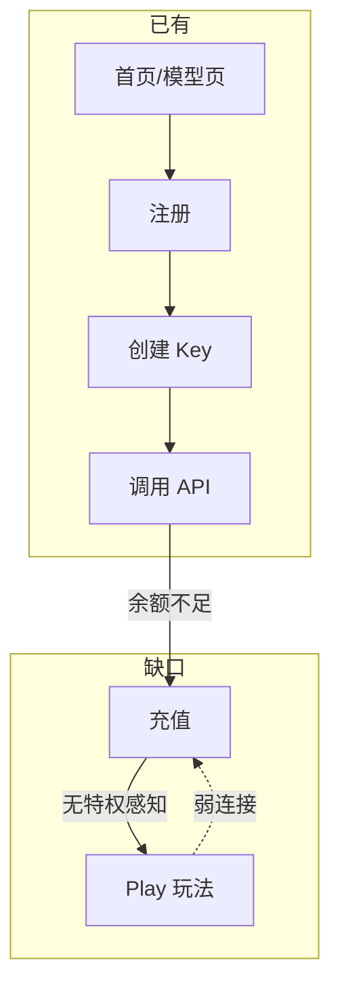

# Play 增长操作系统 — 完整方案与落地路线图

> **战略一句话**：Play 不是「送余额的小游戏」，而是驱动 **更频繁调用 API → 更愿意充值 → 更愿意拉人** 的增长操作系统。

---

## 1. 现状审计（基于代码，2026-07）

### 1.1 已落地能力

| 模块 | 后端 | 前端 | Admin 开关 |
|------|------|------|-----------|
| 每日签到 | `POST /play/checkin` | `/check-in` | `play_checkin_*` |
| Token 农场 (Arena) | 月度周期 + 排行 | `/arena` | `play_arena_enabled` |
| 盲盒 | 扣费随机返 | `/blindbox` | `play_blindbox_*` |
| 答题闯关 | 每日题库 | `/quiz-quest` | `play_quiz_*` |
| Agent Team | 建队/加入 | `/agent-team` | `play_agent_team_enabled` |
| 公开模型价 | `GET /public/models` | `/models` | `public_models_enabled` |
| 首页实时统计 | `GET /public/home-stats` | `HomeView` + `useHomeLiveStats` | — |
| 公开增长 Teaser | `GET /public/growth-teaser` | 首页 / 注册页 `usePublicGrowthTeaser` | 聚合 `play_*` / `affiliate_*` / 注册赠金 |
| 支付充值 | 完整订单流 | `/purchase` | `payment_*` |
| 邀请返利 | Affiliate 全链路 | `/affiliate` | `affiliate_*` |
| 余额低通知 | 邮件 + 阈值 | Profile 配置 | `balance_low_notify_*` |
| 首页 Channel TV | — | `ChannelTV.vue` | — |

### 1.2 核心缺口（转化漏斗断裂点）



| 缺口 | 影响 | Sprint |
|------|------|--------|
| 无 Play Hub 聚合 | 用户不知道「今天还能做什么」 | **A** ✅ |
| 公开页福利文案静态/不准 | 首页/注册页无法反映真实赠金与玩法 | **体验层** ✅ `growth-teaser` |
| Play 与充值无联动 | 玩法只送钱，不拉 ARPU | B（部分：Recharge Boost ✅） |
| 余额低提醒仅邮件 | Dashboard 无强 CTA | **A** ✅ |
| Arena 无结算/差距展示 | 缺冲榜动机 | **A** 差距 / B 结算 |
| 无签到 streak / 补签 | 日活抓手弱 | B |
| 无 VIP 档位 | 缺身份感与消费阶梯 | **C** ✅ 5.1 |
| 无活动引擎 | 运营节奏难落地 | **C** ✅ 5.3 |
| Affiliate × Team 未联动 | 裂变理解成本高 | **C** ✅ 5.2 |

---

## 2. 目标指标

| 指标 | 基线 | Sprint A 目标 | 长期目标 |
|------|------|--------------|---------|
| 注册 → 首充转化率 | 待埋点 | +15%（首充 Banner） | +30% |
| D7 留存 | 待埋点 | Hub 日活入口 | +20% |
| 人均月 token | 待埋点 | Arena 差距展示 | +25% |
| Play 用户充值率 | 待埋点 | Hub CTA 曝光 | Play 用户 2× 非 Play |
| 邀请 → 首充率 | 待埋点 | 文案优化 | +20% |

**埋点建议**（前端 `analytics` 或后端 audit）：
- `play_hub_view` / `play_hub_action_click`
- `dashboard_recharge_cta_click`（source: balance_low | first_recharge | hub）
- `arena_gap_view` / `checkin_from_hub`

---

## 3. Sprint A — 转化（2 周）✅ 本迭代实现

### 3.1 Play Hub（玩法中枢）

**用户故事**
- 作为已登录用户，我希望在一个页面看到今日所有玩法状态和余额，以便决定「赚」还是「充」。
- 作为运营，我希望 Hub 成为 Play 唯一主入口，公开页保留 SEO。

**路由**
- 控制台：`/play`（`PlayHubView.vue`，`AppLayout`）
- API：`GET /api/v1/play/hub`（JWT）

**响应结构**
```json
{
  "any_enabled": true,
  "pending_actions": 2,
  "growth": {
    "balance": 12.5,
    "total_recharged": 0,
    "first_recharge_eligible": true,
    "balance_low_warning": true,
    "balance_low_threshold": 5,
    "recharge_multiplier": 1.2,
    "payment_enabled": true
  },
  "checkin": { "enabled": true, "checked_in_today": false, ... },
  "arena": { "rank": 8, "token_sum": 1200000, "tokens_to_prev_rank": 45000, ... },
  "blindbox": { "can_open": true, "opens_today": 1, ... },
  "quiz": { "already_submitted": false, ... },
  "team": { "team": { "member_count": 3, ... } }
}
```

**`pending_actions` 计算**
- 签到未签 +1
- 盲盒 `can_open` +1
- Quiz 未提交 +1
- Arena 已上榜但非 Top1 且 gap > 0 → 不计入 pending（展示为主）

### 3.2 Dashboard 增长触点

| 组件 | 触发条件 | CTA |
|------|---------|-----|
| `DashboardGrowthBanner` | `balance_low_warning` 或 `first_recharge_eligible` | → `/purchase` |
| `DashboardPlayHubCard` | 任一 Play 开关开启 | → `/play` + 待办数 |

### 3.3 Arena「距上一名差 X tokens」

- 字段：`tokens_to_prev_rank`（rank ≤ 1 时为 0）
- SQL：取 rank-1 用户 token_sum − 当前用户 token_sum
- 展示：Arena 页 + Hub 卡片

### 3.4 侧边栏信息架构

```
增长 / 福利（可折叠）
  ├─ 玩法中枢 /play
  ├─ 每日签到
  ├─ Token 农场
  ├─ 盲盒
  ├─ 答题闯关
  ├─ Agent Team
  └─ 邀请返利
```

### 3.5 Channel TV 登录态增强

- 已登录：频道 hint 追加 Hub 摘要（如「今日 2 项待完成」）
- CH2 跳转改为 `/check-in`（原 docs 保留为 learnMore 链接）

---

## 4. Sprint B — 留存（2 周）✅ 已实现

### 4.1 签到 Streak + 充值补签 ✅
- Migration `172_play_retention.sql`
- `GET /play/checkin/status`：`streak_count`, `next_milestone_*`, `can_makeup`, boost 状态
- `POST /play/checkin/makeup`：24h 内充值后可补签昨日
- 里程碑 JSON：`play_checkin_streak_milestones`
- 前端 `CheckInView` 连续签到 / 补签 / 充值 CTA

### 4.2 Recharge Boost 24h ✅
- 表 `play_recharge_boosts`；充值成功自动激活
- 签到 ×倍率、盲盒额外次数、Arena 展示积分 ×倍率
- Settings：`play_recharge_boost_*`

### 4.3 Arena 周期结算 ✅
- `POST /api/v1/admin/play/arena/settle`
- 奖池 JSON：`play_arena_settlement_rewards`
- 幂等 ledger：`arena_settlement:{periodId}:{userId}`

---

## 5. Sprint C — 身份与裂变（2–3 周）

### 5.1 VIP 累计充值档位 ✅

| 档位 | 累计充值 | 权益 |
|------|---------|------|
| V0 | $0 | 基础 |
| V1 | $50 | 模型页 VIP 标签 |
| V2 | $200 | 盲盒池升级 |
| V3 | $500 | Arena 结算加成 + 邀请返利 +5% |

**实现** ✅
- `GetVIPTier(totalRecharged)` 纯函数 + JSON 可配 `play_vip_tiers`
- `GET /play/hub` → `growth.vip` 展示档位、权益、下一档进度
- 前端 `PlayHubView` VIP 卡片 + `ModelsView` VIP 徽章（V1+）
- 不改计费引擎（避免风险）

### 5.2 Agent Team × Affiliate 联动 ✅

- 小队月 token 达标 → 队长额外返利额度（幂等 `team_affiliate_bonus:{teamId}:{YYYY-MM}`）
- 邀请链接统一带 `?ref=` + `team=`（注册后自动加入小队）
- Settings：`play_team_affiliate_*`

**实现** ✅
- `buildTeamSummaryByID` → `team.affiliate` 进度与队长发奖
- `AffiliateService.AccrueBonusQuota` 发放返利额度
- 前端 `buildRegisterInviteLink` + Register/EmailVerify 自动 join team

### 5.3 限时活动引擎 ✅

**表**：`play_campaigns(id, name, start_at, end_at, rules_json, enabled)`

**rules_json 示例**（疯狂星期四）：
```json
{
  "recharge_bonus_pct": 10,
  "blindbox_extra_opens": 2,
  "arena_score_multiplier": 2
}
```

**实现** ✅
- `GET /play/campaigns/active` + Hub `campaigns[]`
- 规则叠加：盲盒额外次数、Arena 展示倍率（与充值 Boost 可叠加）
- `DashboardCampaignBanner` + `PlayHubView` 活动 Banner
- Settings：`play_campaigns_enabled`；活动行 SQL 维护（无 Admin 编辑器）

---

## 5.4 （未规划）

Sprint C 范围在 5.1–5.3；后续迭代见第 6 节体验层。

## 6. 体验层 — 漏斗优化

### 6.1 首页 → 注册 → 首充

| 阶段 | 改动 | 状态 |
|------|------|------|
| 首页 Hero | `GET /public/growth-teaser` 动态展示注册赠金、签到、模型数、返利等 perks | ✅ |
| 注册页 | 同 API 展示新人权益摘要 | ✅ |
| 公开 Play 页 | 游客 CTA 统一跳转 `/register`（原 `/login`） | ✅ |
| 游客 `/models` | CTA：「登录查看你的分组价 + 新人礼包」 | 部分（VIP 徽章需登录） |
| 新注册首登 | 弹层：创建 Key → curl 示例 → 首充 $X 送 $Y | ✅ `FirstLoginWelcomeModal` |
| 已登录未充值 | Dashboard 首屏弱化图表，强化首充 Banner | Sprint A ✅ |

### 6.2 各模块消费钩子

| 模块 | Sprint A | Sprint B+ |
|------|---------|----------|
| 签到 | Hub 一键签 | streak + 充值双倍提示 |
| 盲盒 | 余额不足 → `/purchase?return=/blindbox` | 概率 UP 活动日 |
| Arena | 差距 + 「去调 API」→ Keys | 预估奖励 + 结算 |
| Quiz | Hub 入口 | 产品导向题库 |
| Team | Hub 进度 | 里程碑奖励 |

### 6.3 信任 → 消费

- 用量页：「本月已省 $X（对比官方价）」— 需 usage API 扩展
- 文档 `/docs` VIP 树与 Hub 档位一致

---

## 7. 营销节奏（活动日历）

| 频率 | 动作 |
|------|------|
| 每日 | 签到、Quiz |
| 每周 | Arena 小周期榜（可选） |
| 每月 | Arena 大奖结算 |
| 节点 | 充值加赠活动（Campaign 引擎） |

---

## 8. 技术约束与原则

1. **不引入玩法代币** — 统一 balance，降低认知成本
2. **奖池先用 JSON + settings** — 不做复杂 Admin 编辑器
3. **公开页保留 SEO** — 消费行为在登录后 Hub
4. **幂等发奖** — 沿用 `play_reward_ledger.idempotency_key`
5. **服务器验收** — 部署 Dell `192.168.100.10:8206`（`./scripts/push-github-and-deploy.sh` 或显式 `play/main`），禁止本地 dev 验收

---

## 9. 文件索引（Sprint A 实现）

| 层 | 路径 |
|----|------|
| 方案 | `docs/growth-play-roadmap.md` |
| Hub API | `backend/internal/service/play_hub.go` |
| Arena gap | `backend/internal/repository/play_repo.go` |
| Handler | `backend/internal/handler/play_handler_hub.go` |
| 路由 | `backend/internal/server/routes/play.go` |
| 前端 API | `frontend/src/api/play.ts` |
| Hub 页 | `frontend/src/views/user/PlayHubView.vue` |
| Dashboard | `frontend/src/components/user/dashboard/DashboardGrowthBanner.vue` |
| Dashboard | `frontend/src/components/user/dashboard/DashboardPlayHubCard.vue` |
| 侧边栏 | `frontend/src/components/layout/AppSidebar.vue` |
| Channel TV | `frontend/src/components/home/ChannelTV.vue` |
| VIP 档位 | `backend/internal/service/play_vip.go` |
| VIP 迁移 | `backend/migrations/173_play_vip.sql` |
| Team × Affiliate | `backend/internal/service/play_team_affiliate.go` |
| Team × Affiliate 迁移 | `backend/migrations/174_play_team_affiliate.sql` |
| 活动引擎 | `backend/internal/service/play_campaign.go` |
| 活动迁移 | `backend/migrations/175_play_campaigns.sql` |
| 公开增长摘要 API | `backend/internal/service/public_growth_teaser.go` |
| 公开增长摘要 Handler | `backend/internal/handler/public_growth_teaser.go` |
| 首页实时统计 Handler | `backend/internal/handler/public_home_stats.go` |
| 前端增长摘要 | `frontend/src/api/publicGrowthTeaser.ts` |
| 前端增长 Composable | `frontend/src/composables/usePublicGrowthTeaser.ts` |
| 首登引导弹层 | `frontend/src/components/user/dashboard/FirstLoginWelcomeModal.vue` |
| 首登标记工具 | `frontend/src/utils/firstLoginWelcome.ts` |

### `GET /api/v1/public/growth-teaser` 响应字段

```json
{
  "registration_enabled": true,
  "signup_balance_usd": 1.0,
  "signup_grant_enabled": true,
  "payment_enabled": true,
  "checkin_enabled": true,
  "checkin_daily_reward": 0.5,
  "affiliate_enabled": true,
  "affiliate_rebate_pct": 10,
  "public_models_enabled": true,
  "public_model_count": 42,
  "play_any_enabled": true,
  "play_features": ["checkin", "arena", "blindbox"],
  "vip_tiers_enabled": true,
  "total_requests": 1234567,
  "has_live_stats": true
}
```

### `GET /api/v1/public/home-stats` 响应字段

```json
{
  "total_requests": 1234567,
  "availability_pct": 99.97,
  "avg_ttft_ms": 842,
  "has_live_data": true
}
```

`availability_pct` / `avg_ttft_ms` 在无请求量时为 `null`；前端 `useHomeLiveStats` 做降级展示。

---

## 10. 验收清单（Sprint A）

- [ ] 登录用户访问 `/play` 看到聚合状态与余额
- [ ] Dashboard 余额低 / 首充 Banner 正确展示
- [ ] Arena 显示「距上一名还差 X tokens」
- [ ] 侧边栏「增长/福利」分组可折叠
- [ ] Channel TV 登录态显示待办提示
- [ ] 全部 Play 开关关闭时 Hub 显示引导文案
- [ ] `GET /play/hub` 契约测试通过
- [ ] 首页 Hero 根据 `GET /public/growth-teaser` 展示动态 perks
- [ ] 注册页展示新人权益摘要（同 API）
- [ ] 公开 Play 页游客 CTA 跳转 `/register`
- [ ] `GET /public/growth-teaser` 单元测试通过
